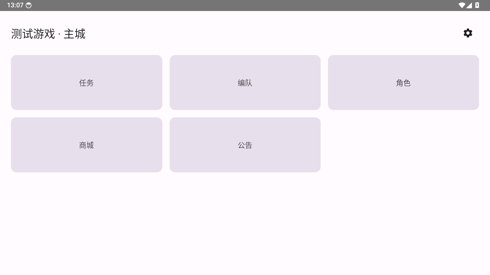
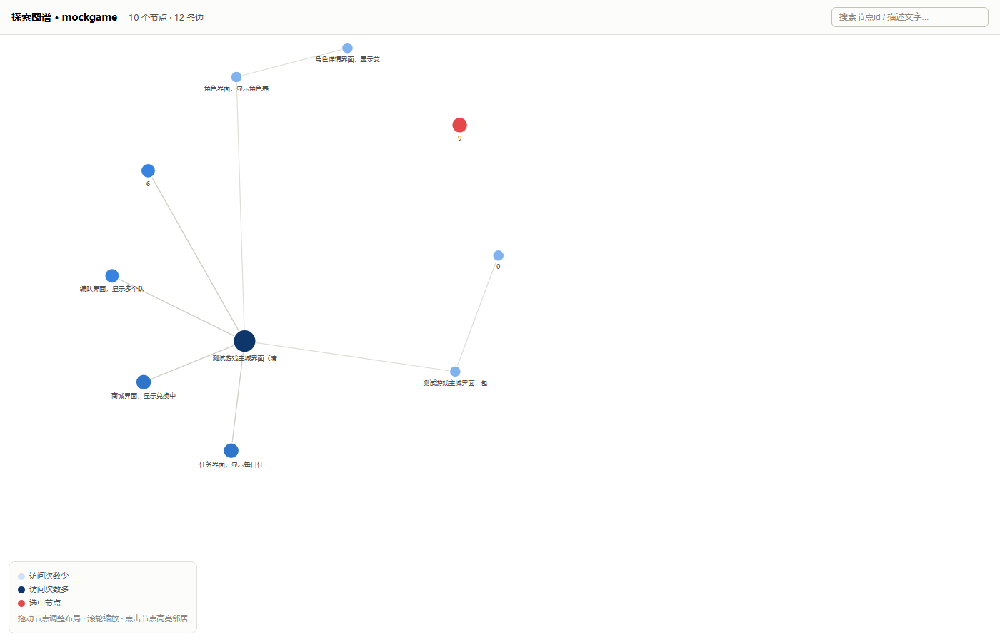

# 通用手游 Agent

用 LLM（ReAct 循环）当决策大脑、MaaFramework 当手脚，对手游做自由探索、接受用户
指令执行任务。`core/` 目录下的代码游戏无关，接入新游戏只需要在 `games/<游戏>/`
下补一份 `profile.yaml` + 资源，不改 `core/` 一行代码。第一个落地游戏是无期迷途，
资源来自 [MBCCtools](https://github.com/quietlysnow/MBCCtools)；另外配了一个干净的
测试用安卓 app（`mock_game_app/`，见下文"测试"一节），专门用来在没有真实游戏 OCR
噪声干扰的情况下验证探索流程本身对不对。

## 效果预览

下面两张图都来自`mock_game_app`（测试用安卓app，见"测试"一节）跑的一次自由探索：

<p float="left">
  
  
</p>

左边是`mock_game_app`的主城界面；右边是同一次探索生成的图谱（`core/tools/visualize_graph.py`
渲染成的本地网页），节点颜色深浅代表访问次数、红色是孤立节点，鼠标悬浮能看到每个
节点的描述文字、点击节点会高亮它的邻居。

## 架构总览

core/按职责分成六个子包，接入新游戏不需要碰这里任何一行：

```
core/agent/     ReActAgent装配与调度
  agent_runner.py        HelloAgents装配：ReActAgent + MCP工具 + 双模型路由
  react_agent_vision.py  给ReActAgent打补丁：多模态图片消息 + 长短期记忆压缩
  idle_scheduler.py      空闲自动探索，用户活动时让位
  log_broadcaster.py     实时日志面板的SSE推送

core/device/    MaaFramework/模拟器设备层
  maa_mcp_server.py      MCP Server：截图/OCR/点击/滑动/BFS自动导航，游戏无关
  emulator.py            一键拉起本机模拟器 + 等它真正就绪
  navigate_demo.py       真机BFS导航演示（不经过LLM）

core/memory/    跨会话持久化
  exploration_memory.py  探索记忆：节点+操作图
  image_similarity.py    像素diff兜底节点身份判断
  skill_store.py         技能库：成功路径可以固化成可复用技能
  usage_log.py           使用记录：按game_id记录每次跑了什么模式/输入/结果，不同app互不干扰
  progress_estimate.py   进度估计：frontier_progress + discovery_rate双指标

core/safety/    风控护栏
  safety_guard.py        坐标白名单 + 敏感词整屏拦截（硬护栏）
  risk_gate.py           单个候选点击的风险评估 + 待确认队列（软风控）

core/intent/    指令执行
  intent_router.py       意图→目标定位：已知技能/语义状态搜索/目标导向探测
  execute_intent.py      意图执行入口，串起上面这几个模块

core/tools/     离线维护脚本
  dedupe_nodes.py        离线批量合并重复节点
  cleanup_graph.py       离线整理悬空边/重复动作/孤立节点
  visualize_graph.py     把探索图谱渲染成可拖拽/缩放的本地网页
  review_pending.py      人工审阅risk_gate记录的待确认队列，选择性放行
```

## 环境准备

```
python -m venv .venv
./.venv/Scripts/pip install -r requirements.txt   # Windows
# source .venv/bin/activate && pip install -r requirements.txt  # macOS/Linux
```

复制`.env.example`为`.env`并填写LLM相关的key（`LLM_MODEL_ID`/`LLM_API_KEY`/`LLM_BASE_URL`）。

模拟器/真机需开启adb调试，且`games/无期迷途/profile.yaml`里的`adb.address`要能连上；
如果本机装了多个adb，建议在profile里显式填`adb.adb_path`，否则会用
`maa.toolkit.Toolkit.find_adb_devices()`自动探测。

如果用雷电模拟器，可以在`.env`里填`LDCONSOLE_PATH`（`ldconsole.exe`的路径）和
`LDPLAYER_INDEX`，`agent_runner.py`启动时会自动检查模拟器有没有在跑、没跑就拉起，
等adb连上、系统开机完成才继续，不用每次手动开模拟器再跑代码；不填这两个变量就
维持原样，自己管理模拟器/用真机。也可以单独跑这一步（比如只是想把模拟器开起来，
不马上跑agent）：

```
./.venv/Scripts/python core/device/emulator.py games/无期迷途/profile.yaml
```

## 单独测试MAA-MCP-Server

不经过LLM，先验证MaaFramework这一层能不能跑通：

```
./.venv/Scripts/python core/device/maa_mcp_server.py games/无期迷途/profile.yaml
```

进程会常驻并通过stdio等待MCP客户端连接（比如用MCP Inspector连上去手动调用
`screenshot`/`click`/`swipe`/`list_known_tasks`/`run_known_task`/`list_pending_confirmations`）。

## 跑自由探索Agent

```
./.venv/Scripts/python core/agent/agent_runner.py games/无期迷途/profile.yaml
```

`agent_runner.py`会自动拉起`maa_mcp_server.py`子进程（通过stdio），把它暴露的工具注册进
HelloAgents的`ReActAgent`，然后开始自由探索。探索记忆按game_id分目录存在
`exploration_logs/<game_id>/nodes/`下，一个界面节点一个json文件，记录了这个界面的OCR特征、
以及探索时在这个界面上验证过坐标的操作（点了哪里、导向了哪个节点），重复运行不会互相污染。
每个节点第一次出现时的截图也存在同一目录下（`<node_id>.png`），想知道某个节点长什么样
直接打开对应图片看就行，不用只靠OCR文字猜。

再次遇到已经探索过、且已经摸不出新候选的界面时，`screenshot()`会沿着已知有效边自动跳到
最近一个还有未试候选的节点（BFS自动导航），不用LLM一步步手动重放；碰到高危候选（命中
`core/safety/risk_gate.py`的敏感词/不可逆语义）会跳过、记入待确认队列，不阻塞探索——用
`core/tools/review_pending.py`可以事后审阅、选择性放行执行。

如果在`.env`里配置了`LLM_MODEL_ID_ROUTINE`，命中已知节点时会自动切到那个更便宜的纯文本
模型（不需要视觉能力）；探索没见过的新界面时始终用`LLM_MODEL_ID`那个多模态模型。

## 下指令而不是自由探索

```
./.venv/Scripts/python core/agent/agent_runner.py games/无期迷途/profile.yaml "帮我领取今日签到奖励"
```

带第三个参数就是执行用户指令，不带就是自由探索（默认行为不变）。两种模式复用同一套
MCP工具/探索记忆/known_actions重放/双模型路由，只是prompt里的"目标"不一样。

更结构化的意图执行（不进ReActAgent的多步推理，先查已知技能库→再查图上语义相近的已知
状态→都没有再报告"需要目标导向探测"）：

```
./.venv/Scripts/python core/intent/execute_intent.py games/无期迷途/profile.yaml "去商城看看"
```

命中高危操作时会同步阻塞、在终端里直接问是否继续——跟自由探索模式"跳过记待确认"的
软性处理不同，这里假设用户此刻在场。

运行时终端会打印一个本地网页地址（默认`http://127.0.0.1:8765`），浏览器打开就能实时看到
LLM调用/工具调用/敏感界面拦截等日志（`core/agent/log_broadcaster.py`，给`ReActAgent`自带的
TraceLogger包了一层SSE推送，不影响原有的`memory/traces/`落盘）。端口可以在profile.yaml里加
`dashboard: {host: ..., port: ...}`覆盖。

## 空闲自动探索

```
./.venv/Scripts/python core/agent/idle_scheduler.py games/无期迷途/profile.yaml [空闲阈值秒] [轮询间隔秒]
```

持续运行，空闲超过阈值且`core/memory/progress_estimate.py`判断"还没探完"时自动拉起一段自由探索；
检测到用户活动（`agent_runner.py`带指令跑一次就会记一次）立刻终止当前探索，让位给用户。

## 查看使用记录

```
./.venv/Scripts/python core/memory/usage_log.py <game_id>            # 汇总：总次数/按模式分组/最近一次
./.venv/Scripts/python core/memory/usage_log.py <game_id> --all      # 加上完整历史
./.venv/Scripts/python core/memory/usage_log.py <game_id> --context  # 压缩后可直接喂给LLM的版本
```

`agent_runner.py`（自由探索/指令执行）和`execute_intent.py`（结构化意图执行）每跑一次都会
往`exploration_logs/<game_id>/usage_log.jsonl`追加一条记录，不同app（不同game_id）的
记录存在各自目录下，互不干扰。历史记录不管积累多少条，`--context`那份摘要长度都有上限——
最近几条留完整细节，更早的压缩成按模式/结果分组的聚合统计，跟`core/agent/react_agent_vision.py`
的长短期记忆压缩是同一个思路。

## 探索图谱：查看与整理

```
./.venv/Scripts/python core/tools/visualize_graph.py <game_id>          # 渲染成可拖拽/缩放的网页
./.venv/Scripts/python core/tools/dedupe_nodes.py <game_id>             # 离线合并重复节点
./.venv/Scripts/python core/tools/cleanup_graph.py <game_id>            # 清理悬空边/重复动作
./.venv/Scripts/python core/tools/cleanup_graph.py <game_id> --delete-isolated   # 连孤立节点一起清
./.venv/Scripts/python core/device/navigate_demo.py games/无期迷途/profile.yaml <目标node_id>  # 真机BFS导航演示
```

不要在`agent_runner.py`还在跑的时候执行这几个离线脚本——会跟正在跑的会话同时读写
`exploration_logs`，状态会打架。

## 测试

```
./.venv/Scripts/pip install -r requirements-dev.txt
./.venv/Scripts/python -m pytest
```

`tests/`下是纯逻辑单元测试（节点匹配、BFS寻路、风险评估、意图路由等，不需要真实设备）。
`mock_game_app/`是一个干净、内容可控的测试用安卓app（Jetpack Compose），覆盖常见二次元/
养成类手游UI模式（主城图标墙、弹窗诱导跳转、公告tab+列表、角色详情多级tab、兑换列表、
任务进度、编队多选、纯图标按钮、敏感词误报），配套`games/mockgame/profile.yaml`接入，
用来把"探索流程本身对不对"和"真实游戏OCR太脏"分开验证，构建方法见
`mock_game_app/README.md`。

## 接入新游戏

复制`games/_template/`，按里面的README checklist填。验证标准：接入过程中`core/`目录
不应该有任何改动。
